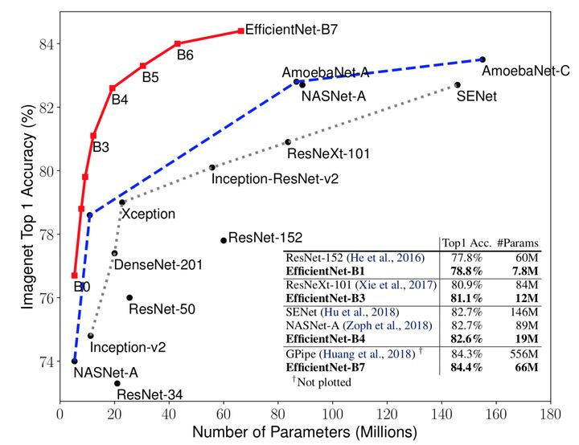
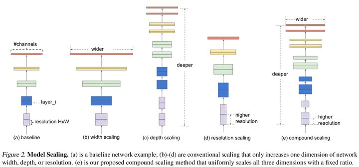
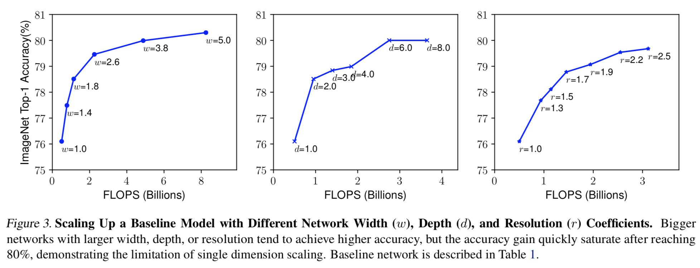
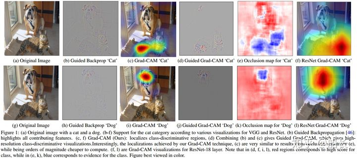
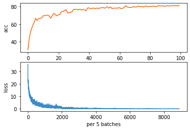
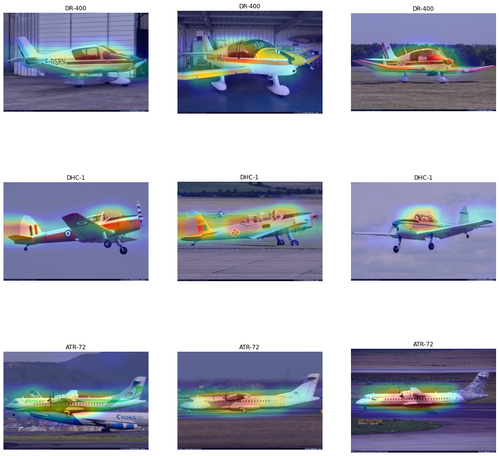

   

# 飞机细粒度分类
## 1 项目背景及目标
细粒度图像分类问题是对大类下的子类进行识别。细粒度图像分析任务相对通用图像（General/Generic Images）任务的区别和难点在于其图像所属类别的粒度更为精细。
导入预训练的EfficientNet模型在一百类飞机数据集上进行训练，得到了一个准确度较高的分类模型。基于该模型可以实现飞机的快速分类。
## 2 项目简介
完成的任务包括：  
对数据集做在线数据增强，包括随机裁剪、水平翻转、随机仿射变换等。
将训练数据集送入EfficientNet-B4模型进行训练，每五个batch记录loss，每个epoch在test数据集上计算accurracy并记录，最后得到并分析loss和acc变化曲线。
main.ipynb的代码组成为：
1. 导入依赖库
2. 全局变量定义
3. 日志设置
4. 数据读取
5. 模型训练
6. loss和acc曲线绘制

## 3 理论基础
### 3.1 EfficientNet
EfficientNet发布于2019年5月28日，发布之初就以其在图片分类上各种SOTA结果而惊艳整个CV届。


作者做了两点创新：
- 利用NAS(神经网络搜索)搜索出一个更好的Backbone，也即上图中的EfficientNet-B0。
- 对B0模型的宽度、深度和图片分辨率同时缩放得到B1-B7。
### 3.1.1 模型缩放
当我们得到一个基础模型后，为了提高模型的复杂度，进而提高模型的性能，我们一般会对模型做适当的缩放。常用的缩放方法是:
1. 增大模型宽度
即增加每一个卷积层的通道数
2. 增大模型的深度
将每一个stage重复的单元增加多一些，如resnet50到resnet101的扩展
3. 增大输入图片的分辨率
如下图所示：

如果单一缩放这三个维度，模型精度都有提升，但很快都饱和了，如下图。

这是因为模型的宽度、深度和图片分辨率三者是互相关联的，当深度增加时，模型的宽度、输入图片的分辨率都要跟着增加才会得到最好的效果。
### 3.1.2 组合缩放系数
当计算资源增加时，如果彻底的去搜索宽度、深度、图片分辨率这三个变量的各种组合，那么搜索空间将无限大，搜索效率会非常低。
因此作者提出了组合缩放的方法：
$$depth: d = \alpha ^ {\phi}$$
$$width: \omega = \beta ^ {\phi} $$
$$resolution: r = \gamma ^ {\phi}$$
$$s.t. \alpha \cdot \beta ^ 2 \gamma ^ 2 \thickapprox 2$$
$$\alpha \geqslant 1 , \beta \geqslant 1, \gamma \geqslant 1$$
用单一的组合缩放系数$\phi$，同时缩放宽度、深度和图片分辨率，缩放公式如上图。而深度、宽度和分辨率的缩放基数$\alpha ,\beta ,\gamma$，由在基准模型上取$\phi = 1$做参数搜索得到，作者在Efficient-B0上搜索的最终结果是$\alpha = 1.2,\beta = 1.1,\gamma = 1.15$。
需要解释一下，为什么要做约束：
$$s.t. \alpha \cdot \beta ^ 2 \gamma ^ 2 \thickapprox 2$$
当对模型升读、宽度和分辨率做缩放时，当模型深度增加时，计算量成线性增加，当模型宽度和分辨率增加时，计算量以二次方增加，因此对应的计算量大约为：
$$\alpha ^{\phi} \cdot (\beta ^{\phi})^ 2 \cdot (\gamma ^{\phi})^ 2 = (\alpha \cdot \beta^2 \cdot \gamma^2 )^{\phi}$$
如果做以上约束，那么当深度则当模型深度、宽度和分辨率统一缩放$\phi$时，最终的计算量大约增加为$2^{\phi}$,有了这个约束，就可以根据计算资源的变化来反推组合缩放系数$\phi$的大小。
我们直观感受下B0-B7缩放的尺度：
```python
# Coefficients:   width,depth,res,dropout
'efficientnet-b0': (1.0, 1.0, 224, 0.2),
'efficientnet-b1': (1.0, 1.1, 240, 0.2),
'efficientnet-b2': (1.1, 1.2, 260, 0.3),
'efficientnet-b3': (1.2, 1.4, 300, 0.3),
'efficientnet-b4': (1.4, 1.8, 380, 0.4),
'efficientnet-b5': (1.6, 2.2, 456, 0.4),
'efficientnet-b6': (1.8, 2.6, 528, 0.5),
'efficientnet-b7': (2.0, 3.1, 600, 0.5),
```
### 3.1.3 EfficientNet 评价
EfficientNet之所以被众人所知，最大的原因就是其又快又准的SOTA（State Of The Art）结果。而能够有如此结果，其实是组合缩放+更好的Backbone(EfficientNet-B0)双重作用的结果。而Efficient-B0是用NAS(Neural Architecture Search)搜索出来的，这也意味着如果没有足够的计算资源，EfficientNet是无法实现的。
### 3.2 grad-CAM
Grad-CAM(Class Activation Map)也就是类激活热力图，直观地告诉我们模型在一个图片中的敏感区域，在图中我们可以得到预猫类别的时候模型更关注猫的身体，而狗类别的时候更关注狗的头部。


## 4 实验结果

对于一百分类，网络在测试集上达到89%的精度，收敛很快。
<div style="align: center">

</div>

 由热力图，我们可以看到对于不同种类的飞机，EfficientNet-b4关注的部位有所不同，但都关注的是显著特征的部位，训练结果合理。
<div style="align: center">

</div>
